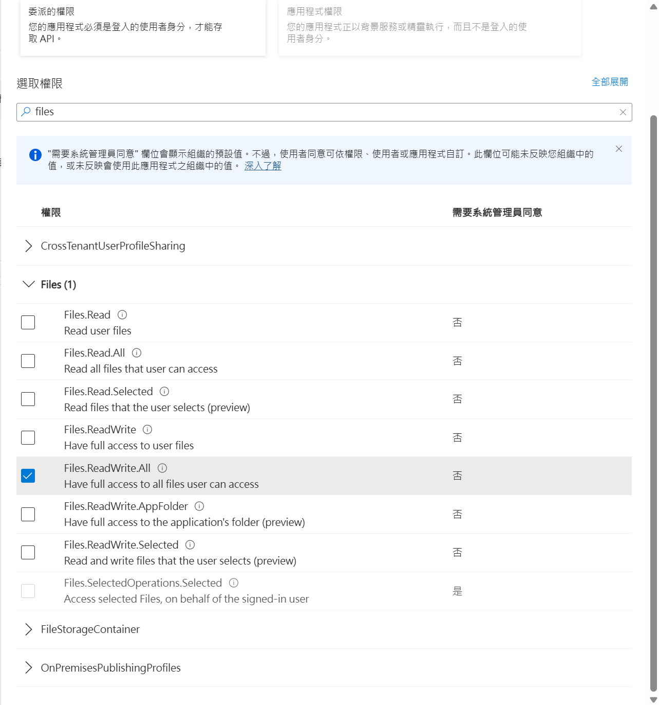

# OneDrive 授權工具

> 項目 [AlistGo/alist](https://github.com/AlistGo/alist) 由個人開發者轉由企業維護後，此前的回傳頁面 `https://alist.nn.ci/tool/onedrive/callback` 已經無法正常使用，官網文檔也無法正常查看，加之大家對原先的驗證方式亦有隱私權的顧慮，故編寫了幾個簡單的頁面和一個使用教程。

> 本工具旨在協助用戶自行完成 OneDrive 授權，適用於 Alist 等第三方掛載場景，無需將敏感資訊交給他人。

## 使用步驟

### 一、註冊 Azure 應用

1. 登入 [Azure 門戶](https://portal.azure.com/)
2. 新增應用，取得 `client_id`（Application (client) ID）
3. 在「重定向 URI」新增您的 GitHub Pages 頁面地址，例如：`https://onedrive-licensing.moranxia.com/auth/callback` 或  `https://locolhost:3000/auth/callback` 平台選「Web」
4. 選擇正確的應用程序類型：
   - **重要**：在「身份驗證」頁面，選擇平台類型為「**Web**」（推薦用於 Alist）
   - 請勿選擇「單頁應用 (SPA)」，這會導致 Alist 無法使用相應的 token
   - 重定向 URI 設定必須與授權頁面指定的一致
5. 配置 API 權限：
   - 進入「API 權限」頁面
   - 點擊「添加權限」> 選「Microsoft Graph」>「委託的權限」
   - 搜尋 `Files`，勾選所需權限（如 Files.ReadWrite.All）
   - 點擊「添加權限」保存

   

6. 獲取 client_secret
   - 在 Azure 入口左側選單點選「憑證與密碼」（Certificates & secrets）
   - 點擊「新用戶端密碼」（New client secret）
   - 輸入描述（可隨意填寫，例如：AList 掛載）
   - 選擇過期時間（建議選擇 12 個月或 24 個月，過期後需重新生成）
   - 點擊「新增」後，會在下方列表中看到剛剛產生的密碼，**請務必複製並保存這一串值**，之後將無法再次查看！
   - 這個值就是 `client_secret`，稍後在本地 .env 或 Vercel 環境變數中填寫

> ⚠️ **應用類型和 API 權限配置非常重要！**
> 應用類型必須設置為「Web」，否則 Alist 可能會出現 AADSTS90023 錯誤
> 未正確配置 API 權限將導致授權後無法訪問 OneDrive 文件

## 運行

分為本地運行和 Vercel 運行。

### 本地運行

1. 複製 `.env.example` 為 `.env` 並填入您的配置：

   ```bash
   # Microsoft OAuth 設定
   CLIENT_ID=your_client_id_here
   CLIENT_SECRET=your_client_secret_here
   REDIRECT_URI=http://localhost:3000/auth/callback
   PORT=3000 #可選
   ```

2. 安裝依賴：

   ```bash
   npm install
   ```

3. 啟動服務：

   ```bash
   npm start
   ```

4. 在瀏覽器打開 `http://localhost:3000`

### Vercel 部署

[](https://vercel.com/import/project?template=https://github.com/moranjianghe/onedrive-licensing-tool-for-alist)

1. 點擊上方按鈕，或直接將本儲存庫連結到 Vercel
2. 在 Vercel 環境變數設定中添加：
   - `CLIENT_ID`
   - `CLIENT_SECRET`
   - `REDIRECT_URI` (必須是 `https://your-vercel-app.vercel.app/auth/callback`)
   - `REGION` (可選，預設為 global)

### Vercel 部署後使用

部署完成後，直接訪問您的 Vercel 應用程式網址，按照界面指引完成授權即可。

## AList 掛載說明

成功獲取授權後，您會得到以下資訊：

1. **Client ID**: 您的 Microsoft 應用程式 ID
2. **Redirect URI**: 您配置的重定向 URI
3. **Refresh Token**: 用於獲取存取權限的重要令牌

在 AList 中添加 OneDrive 存儲時：

1. 選擇存儲類型為 "OneDrive"
2. 填入您的 Client ID、Client Secret
3. 將 Redirect URI 設定為預設值或您自己的 URI
4. 填入獲取到的 Refresh Token
5. 選擇正確的區域 (global, cn, us, de)

## 技術細節

- 使用純 Node.js HTTP 模組，無需任何 Web 框架
- 靜態 HTML/CSS/JavaScript 實現用戶界面

## 隱私聲明

本工具僅獲取必要的 Microsoft 授權令牌，不存儲或傳輸您的任何個人資料。所有授權過程均在您的瀏覽器中進行，獲取的令牌僅顯示給您本人。

## 參考資源

- [Alist 官方文件](https://github.com/AlistGo/docs/blob/main/docs/zh/guide/drivers/onedrive.md)
- [微軟 Azure 應用註冊文檔](https://learn.microsoft.com/zh-cn/azure/active-directory/develop/quickstart-register-app)
- [GitHub Pages 官方說明](https://pages.github.com/)

## 最后

<del>如遇其它技術問題，可在本項目 issue 區留言或提交討論。</del>代碼都是 AI 寫的，出了問題可以給我留言但我也不一定有能力處理。歡迎改善本項目。
